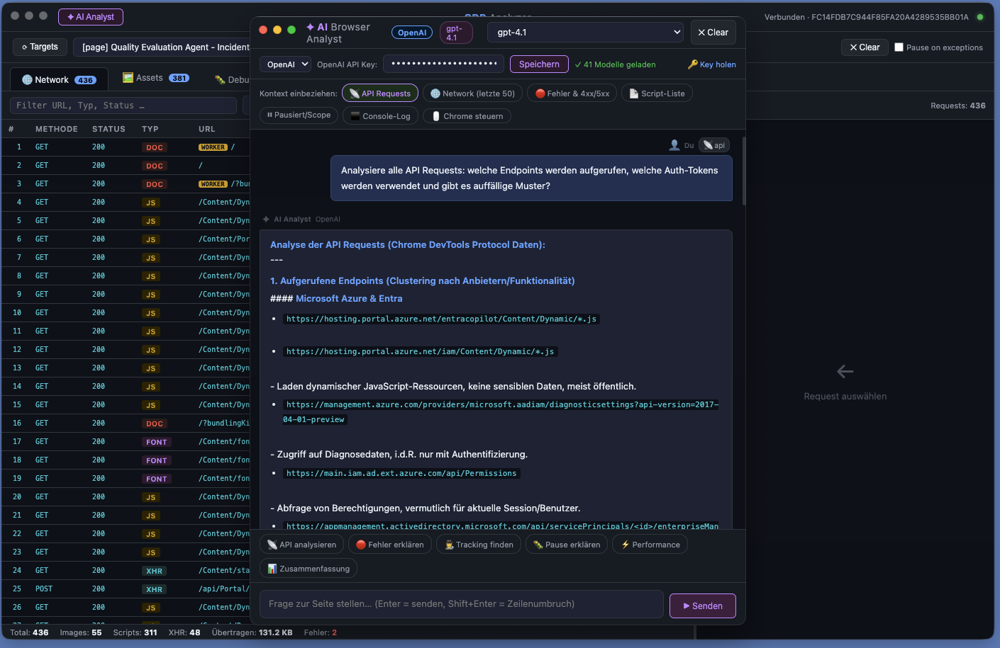

# CDP Analyzer

**Echtzeit-Analyse von Browser-Netzwerkverkehr, Scripts, Konsole und API-Daten — direkt aus Chrome via Chrome DevTools Protocol.**



---

## Was ist das?

CDP Analyzer ist eine Electron-App, die sich per WebSocket in einen laufenden Chrome-Browser einklinkt und alle Netzwerkaktivitäten, JavaScript-Ausführung und API-Kommunikation in Echtzeit aufzeichnet. Besonders geeignet für:

- Analyse von **Enterprise-Portalen** (Azure, Microsoft 365, SAP, etc.)
- Aufdecken **versteckter API-Calls** (Worker, WebSocket, Beacon, Batch)
- **JWT-Token-Inspektion** direkt im Browser ohne externe Tools
- **KI-gestützte Analyse** mit Gemini oder OpenAI auf Knopfdruck

---

## Features im Überblick

### Netzwerk & API

| Panel | Beschreibung |
| --- | --- |
| 🌐 **Network** | Alle HTTP-Requests live: URL, Methode, Status, Typ, Größe, Zeit, Headers, Body, Timing |
| 📡 **API** | Gefilterte Ansicht für XHR/Fetch/JSON mit Batch-Erkennung, Auth-Analyse und JWT-Decoder |
| 🖼 **Assets** | Bilder, Scripts, CSS, Fonts mit Vorschau und Syntax-Highlighting |
| 🐛 **Debugger** | Breakpoints, Step-through, Scope-Explorer, Call Stack, Object Watcher |
| ⬛ **Console** | Live-Ausgaben + JavaScript-REPL im Browser-Kontext |

### API-Analyse

- **Batch-Request-Expansion** — Microsoft Graph `$batch` und Azure Management Batch werden aufgeklappt: jeder Sub-Request und jede Sub-Antwort einzeln mit Status und Korrelation dargestellt
- **Response-Body-Cache** — Antwort-Bodies werden proaktiv gecacht sobald ein Request abgeschlossen ist, sodass sie auch Minuten später noch abrufbar sind
- **Auth-Tab mit JWT-Decoder** — Bearer Tokens werden client-seitig vollständig dekodiert: Name, UPN, Tenant-ID, Object-ID, Scopes, Rollen, Ablaufzeit mit Farbindikator (grün/gelb/rot), Microsoft Entra ID-Badge
- **Automatische API-Erkennung** — erkennt REST-Endpoints anhand von URL-Muster (`/v1.0/`, `/api/`, `/odata/`) und Host-Pattern (`config.`, `graph.`, `data.`, `events.`, etc.)

### Versteckte Calls aufdecken

- **Worker-Tracking** — Service Worker und Web Worker Netzwerk-Traffic über `Target.setAutoAttach`
- **WebSocket / SSE** — Frames und Messages werden im Network-Stream angezeigt
- **Beacon** — `navigator.sendBeacon`-Calls werden erfasst
- **Deep Intercept** — Monkey-Patch per `Page.addScriptToEvaluateOnNewDocument` injiziert Hooks für `fetch`, `XMLHttpRequest`, `WebSocket`, `EventSource` und `sendBeacon` noch bevor Seiten-JavaScript läuft

### KI-Assistent (AI Browser Analyst)

- **Zwei Provider**: Google Gemini und OpenAI (GPT-4.1, o3, o4-mini, …) — umschaltbar ohne Neustart
- **Kontext-Pills**: `📡 API Requests` · `🌐 Network` · `🔴 Fehler` · `📄 Scripts` · `⏸ Debugger` · `⬛ Console` — wähle was der Agent sehen soll
- **Drei Agenten-Tools**:
  - `searchInData("agent")` — Volltext-Suche in allen gecachten Request- und Response-Bodies
  - `getResponseBody(id)` — Lädt den vollen JSON-Body eines bestimmten Requests
  - `getCdpContext(type)` — Liest strukturierte Metadaten (API, Network, Errors, Scripts, Console, Paused)
- **Browser-Steuerung** — Agent kann Chrome navigieren, klicken, tippen und JavaScript ausführen
- **Batch-Analyse** — Sub-Requests werden dem Agenten vollständig aufgeklappt übergeben inkl. `dependsOn`-Ketten
- **JWT-Payload im Kontext** — Auth-Tokens werden decodiert an die KI übergeben (Name, UPN, Scopes, Rollen, Ablauf)

### UI & Bedienung

- **Kopieren überall** — Klick auf Header-Werte, Body-Blöcke mit `⎘`-Button, Code-Blöcke im Chat-Fenster
- **Resizable Panels** — Breite der Detail-Panes per Drag & Drop anpassbar
- **Zeilenkopie** — Jede Zeile in Network/API-Tabelle hat einen `⎘`-Button für die URL
- **Syntax-Highlighting** — JSON, Response-Bodies und JWT-Payloads farbig hervorgehoben

---

## Setup

```bash
npm install
```

---

## Release bauen

Releases werden über Git-Tags ausgelöst. Ein Tag im Format `v0.0.1`
setzt im GitHub-Action-Build automatisch die App-Version auf `0.0.1`,
baut die Installer und veröffentlicht sie als GitHub Release.

```bash
git tag v0.0.1
git push origin v0.0.1
```

Die Action erstellt:

- macOS ARM64 Paket ohne Rosetta-Abhängigkeit (`.pkg`, `.dmg` und `.zip`)
- Windows x64 Installer (`.exe`)

Die gebaute Version ist in der Anwendung im nativen Menü sichtbar.

Stabile Latest-Download-Links:

- macOS ARM64 PKG: <https://github.com/JoergBrors/CDP-Analyzer/releases/latest/download/CDP-Analyzer-mac-arm64.pkg>
- macOS ARM64 DMG: <https://github.com/JoergBrors/CDP-Analyzer/releases/latest/download/CDP-Analyzer-mac-arm64.dmg>
- Windows x64 Installer: <https://github.com/JoergBrors/CDP-Analyzer/releases/latest/download/CDP-Analyzer-win-x64.exe>

---

## Starten

```bash
npm start
```

Beim Start prüft der Splash-Screen automatisch, ob Chrome bereits auf Port 9222
mit Remote-Debugging läuft. Falls nicht, sucht CDP Analyzer die lokale
Chrome-Installation und kann Chrome direkt mit einem isolierten Profil im
Debug-Modus starten.

### Optional: Chrome manuell mit Remote-Debugging öffnen

**macOS:**

```bash
/Applications/Google\ Chrome.app/Contents/MacOS/Google\ Chrome \
  --remote-debugging-port=9222 \
  --user-data-dir=/tmp/ChromeDebug
```

**Windows:**

```bat
"C:\Program Files\Google\Chrome\Application\chrome.exe" ^
  --remote-debugging-port=9222 ^
  --user-data-dir=C:\ChromeDebug
```

**Linux:**

```bash
google-chrome --remote-debugging-port=9222 --user-data-dir=/tmp/ChromeDebug
```

> `--user-data-dir` muss ein **neues, leeres Verzeichnis** sein.
> Im geöffneten Chrome dann wie gewohnt einloggen — SSO, 2FA, alles funktioniert.

### Verbinden

1. **⟳ Targets** klicken → offene Chrome-Tabs erscheinen
2. Gewünschten Tab auswählen
3. **Verbinden** drücken → grüne Statusleiste erscheint oben rechts

---

## Bedienung

### Network-Panel

- Requests erscheinen live beim Laden der Seite
- **Filter**: Text-Filter, Typ-Filter (XHR / Script / Image / …), `Nur Fehler`-Checkbox
- **Klick auf Zeile** → Detail-Pane rechts:
  - **Headers** — Request/Response-Header mit Copy-Buttons, Post-Data
  - **Body** — Response-Inhalt, JSON wird formatiert und hervorgehoben
  - **Timing** — DNS, Connect, SSL, Send, Receive in ms

### API-Panel

- Zeigt nur API-relevante Requests (XHR, Fetch, JSON, REST-Pfade)
- **Filter**: URL-Text, Methode, `Nur Auth`-Checkbox (nur Requests mit Auth-Header)
- **Batch-Tab**: `$batch`-Requests werden automatisch erkannt und aufgeklappt
- **Auth-Tab**: Zeigt Authentifizierungstyp + vollständig decodierten JWT-Token

### AI Browser Analyst

1. **+ AI Analyst** klicken → Chat-Fenster öffnet sich
2. Provider wählen (Gemini / OpenAI) und API-Key eingeben → **Speichern**
3. Kontext-Pills aktivieren (z.B. `📡 API Requests`)
4. Frage stellen — der Agent holt sich selbstständig die benötigten Daten

**Beispiel-Prompts:**

- `Suche in allen gesammelten Daten nach "agent" und "displayName"`
- `Analysiere alle Batch-Requests und zeige mir die Sub-Requests`
- `Welche Auth-Tokens werden verwendet und sind sie noch gültig?`
- `Erkläre alle Fehler und mögliche Ursachen`

---

## Projektstruktur

```text
cdp-analyzer/
├── package.json
├── index.html              ← Haupt-UI (Network, Assets, API, Debugger, Console)
├── ai-chat.html            ← AI Browser Analyst Fenster
├── docs/
│   └── screenshot.png
└── src/
    ├── main.js             ← Electron Main, CDP-Verbindung, Response-Body-Cache, IPC
    ├── preload.js          ← Sichere Bridge für Haupt-Fenster
    ├── preload-ai.js       ← Sichere Bridge für AI-Fenster
    ├── renderer.js         ← UI-Logik: Network, Assets, API, Debugger, Console
    └── ai-renderer.js      ← AI-Chat-Logik: Gemini + OpenAI, Tools, Kontext
```

---

## Technische Details

| Technologie | Einsatz |
| --- | --- |
| **Chrome DevTools Protocol** | WebSocket-Verbindung direkt zu Chrome |
| `Network.enable` | HTTP-Traffic + proaktives Response-Body-Caching |
| `Target.setAutoAttach` | Worker / Service Worker Netzwerk-Tracking |
| `Fetch.enable` | Request-Interception (Deep Intercept) |
| `Page.addScriptToEvaluateOnNewDocument` | Monkey-Patch-Injektion vor Seiten-JS |
| `Runtime.addBinding` | Reporting aus injizierten Scripts zurück zu CDP |
| **Gemini API** | Streaming via SSE (`streamGenerateContent?alt=sse`) |
| **OpenAI API** | Streaming via `chat/completions` mit `stream: true` |
| **Electron** | Desktop-App-Container, IPC zwischen Main und Renderer |

---

## Hinweise

- Breakpoints überleben einen Seiten-Reload (solange die Script-URL gleich bleibt)
- **Clear** löscht Network + Console, aber nicht Scripts und Breakpoints
- JWT-Dekodierung findet vollständig **client-seitig** statt — keine Daten verlassen den lokalen Rechner (außer an die gewählte KI-API)
- Deep Intercept sollte nur bei Bedarf aktiviert werden, da es alle Requests pausiert und kurz verzögert
- Der Response-Body-Cache hält bis zu 400 Einträge (LRU) — ältere Entries werden automatisch verdrängt
